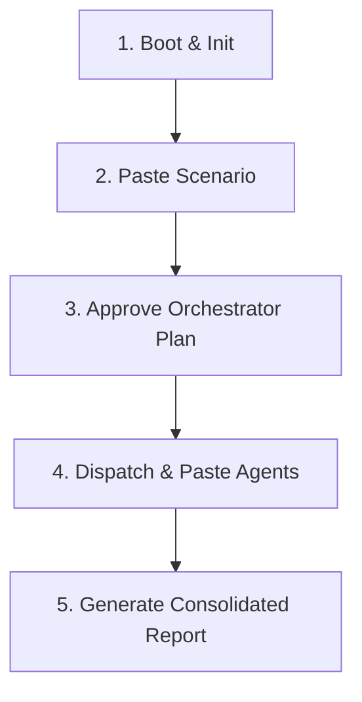

# Contributing to AISOC Farm - Student Guide

Welcome to the **AISOC Farm** university project! This repository is an in-chat, multi-agent AI Security Operations Center built entirely of structured prompts. 

As a student, you will own, author, and test one of the 20 available security agents. Below is the quick, concise flow on how to select, write, and submit your agent, and how to operate the overall farm.

> [!TIP]
> Make sure to double check that no other student has already submitted a Pull Request for your chosen agent before you start working!

---

## 0. Joining the Repository

Before you can push branches or open Pull Requests, you must be added as a collaborator to this repository:

1. **Invitation Link:**
   An invitation link will be sent to you by the course organizers. Click the link and accept the invitation to join the repository.
2. **Alternative Method:**
   If the invitation link does not work or you haven't received it, please contact either **Farouk** or **Hassan** directly. Provide them with your **GitHub username**, and they will manually send you an invitation to join.

---

## 1. Student Rules & Naming Convention

### Step A: Pick Your Agent
1. Look at the 20 agent stubs under [`.aisoc/agents/`](.aisoc/agents/).
2. Choose **one** agent for your project (e.g., `02-ids-triage.agent.md`).

### Step B: Naming Convention
When you implement your agent, you must rename your stub file under `.aisoc/agents/` to include your name. This keeps alphabetical sorting and dispatch order clean.
* **Format:** `NN-agentname-studentname.agent.md`
* **Example:** If student **Farouk** implements **Agent #2 (IDS Triage)**:
  * Original file: `02-ids-triage.agent.md`
  * Renamed file: `02-ids-triage-farouk.agent.md`

> [!WARNING]
> You **must** keep the original two-digit number (e.g. `02-`) prefix at the beginning of the filename. This ensures alphabetical ordering matches the Orchestrator's dispatch sequence.

---

## 2. Submission & Branch Protection Flow

To submit your completed agent, you must follow this Git and Pull Request (PR) workflow:

> [!IMPORTANT]
> **Final Submission Rule:** Your final submission consists of merging to the `dev` branch **ONLY** when your respective agent is 100% complete and fully working. There should be **no premature or unnecessary merge requests** opened before the agent is completely functional. The Pull Request targeting `dev` serves as your final graded submission.

1. **Create a Development Branch:**
   Create a local branch named after your agent and your name:
   ```bash
   git checkout -b agentname-studentname
   # Example: git checkout -b ids-triage-farouk
   ```
2. **Develop, Test, and Commit:**
   Implement and thoroughly test your agent using the [RICTOC format](README.md#rictoc). Commit your changes locally.
3. **Push & Open a Pull Request:**
   Push your branch to GitHub:
   ```bash
   git push origin agentname-studentname
   ```
   Open a **Pull Request** on GitHub from your branch targeting the `dev` branch (this PR represents your final submission).
4. **Request Administrator Permission to Merge:**
   * Direct merges and direct pushes to the `main` and `dev` branches are **strictly blocked** by GitHub's branch protection rules.
   * You cannot merge your own PR.
   * Once your PR to `dev` is created and your agent is fully ready, notify the course instructor / administrator to review it. Only after they approve and merge it will your agent become part of the canonical catalogue on the development branch.

---

## 3. Quick Operation Flow

The entire AISOC Farm runs as a **chat-as-runtime** protocol. Here is the concise flow to boot and operate the farm during testing or grading:



### Flow Steps:
1. **Boot and Init:**
   Start a fresh chat session with your LLM assistant (Claude Code or Copilot Chat) and initialize the farm:
   * **In Claude Code:** Run `/aisoc-init` (or use the `aisoc-init` skill).
   * **Manual / Copilot:** Paste the contents of [`.aisoc/skills/boot/SKILL.md`](.aisoc/skills/boot/SKILL.md), then paste [`.aisoc/skills/catalogue/SKILL.md`](.aisoc/skills/catalogue/SKILL.md).
2. **Load Scenario:**
   Paste a scenario description (e.g., from [`.aisoc/scenarios/01-beaconing.md`](.aisoc/scenarios/01-beaconing.md)).
3. **Approve the Plan:**
   The Orchestrator will output a numbered **PLAN**. Review it and reply with:
   * `approve` (to proceed) or `revise <feedback>` (to adjust).
4. **Dispatch and Execute:**
   The Orchestrator will dispatch agents one by one. When an agent is dispatched:
   * Paste the corresponding student-authored agent prompt file (from `.aisoc/agents/`) along with the requested input data.
5. **Get Report:**
   Once all dispatched agents finish, the Orchestrator validates the findings and produces a consolidated **REPORT**.
